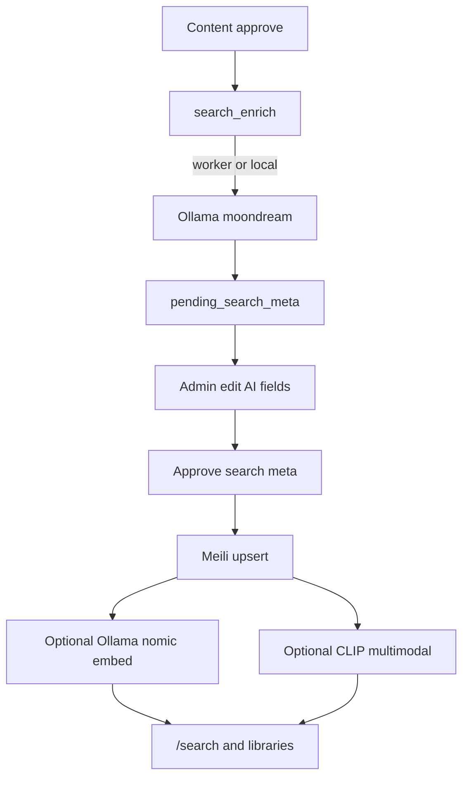

# BLOB

Public sticker library (Next.js). Phase 1: home shell, Zitadel-only auth (roles via Management API + claim mirror), profile edit, admin users/uploads, Glass profile uploads.

## Stack

- Next.js (App Router) + Tailwind v4
- Auth.js + Zitadel (OIDC/PKCE, sole provider; service-account PAT for roles/profile)
- PostgreSQL + Prisma
- Meilisearch (keyword + hybrid + multimodal search; Prisma `contains` fallback if unset)
- Object storage: [glass-ts](https://www.npmjs.com/package/glass-ts)
- Avatars: [blobatar](https://blobatar.dev/) from `username`
- Optional: Ollama (text embed, vision captions, agentic search), remote encode/enrich workers, self-hosted CLIP REST for Meili image search

See [docs/blob-requirements.md](docs/blob-requirements.md), [docs/style-guide.md](docs/style-guide.md), [docs/docker.md](docs/docker.md).

## Quick start

```bash
cp .env.example .env   # fill SESSION_SECRET, Zitadel, DB, MEILI_MASTER_KEY
docker compose up -d --build
```

Or local app + Docker DB (+ Meili if you want search):

```bash
docker compose up -d db meilisearch
npm install
npx prisma migrate deploy
npm run dev
```

## Scripts

| Command | What |
|---------|------|
| `npm run dev` | Next + worker WSS (`tsx server.ts`) |
| `npm run build` / `start` | Production |
| `npm run worker` | Remote-style worker process (needs `.env.worker`) |
| `npm test` | Vitest |
| `npm run db:migrate` | `prisma migrate deploy` |
| `npm run db:restore` | Restore from `storage/backups/postgres` |

## Zitadel console

- Redirect URI: `{AUTH_URL}/api/auth/callback/zitadel`
- Post-logout URI: `{AUTH_URL}/api/auth/logout/callback`
- Auth method: Authorization Code + PKCE (Web)
- Project roles: `user`, `member`, `admin` (BLOB creates them via PAT if missing)
- Service account with PAT + org/project manager rights for Management API (`ZITADEL_SERVICE_PAT`, `ZITADEL_ORG_ID`, `ZITADEL_PROJECT_ID`)

## Glass

Set `GLASS_API_URL` and `GLASS_API_KEY`. The app creates its public PRISM on first approve and stores it in `public_prism` (not env). Members upload to a per-user private prism; admins moderate at `/profile/pending` (approve / request edit / reject). Manage users lives at `/profile/users`.

## Search (Meilisearch + optional Ollama / workers)

Site search is Meilisearch-first (`/search`, landing bar, library pages). If `MEILI_HOST` / `MEILI_MASTER_KEY` are missing or Meili errors, APIs fall back to Prisma `contains`.

### Setup matrix

| Layer | Env | What you get |
|-------|-----|----------------|
| **Prisma only** | Leave `MEILI_HOST` empty | Text search on stickers/collections/prints (legacy). No `/search` facets, hybrid, or image search. |
| **Meili keyword** | `MEILI_HOST`, `MEILI_MASTER_KEY` (compose starts `meilisearch`) | Full-text + facets + popularity ranking once documents are indexed. Indexing still needs search-meta approve (see flows). |
| **+ Ollama text** | `OLLAMA_BASE_URL`, `OLLAMA_EMBED_MODEL=nomic-embed-text` | Hybrid / semantic text search (Meili `ollama` embedder). |
| **+ Ollama auth** | `OLLAMA_API_KEY` + `docker-compose.proxy.yml` on Ollama host | Bearer proxy on `:11435` → local Ollama `:11434` (optional; see below). |
| **+ Ollama vision** | `OLLAMA_VISION_MODEL=moondream` (+ worker or local enrich) | AI captions → admin meta review → richer searchable text. |
| **+ CLIP multimodal** | `MEILI_MULTIMODAL_URL`, `MEILI_MULTIMODAL_MODEL` + `docker-compose.clip.yml` on GPU host | Meili native text→image / image→image (`media` search). |
| **+ Agent** | `OLLAMA_AGENT_MODEL=qwen2.5:3b` | `/search` Agent mode plans a Meili query via Ollama. |
| **InstantSearch UI** | `NEXT_PUBLIC_MEILI_HOST`, `NEXT_PUBLIC_MEILI_SEARCH_KEY` | Browser typeahead via InstantSearch; otherwise `/api/search?suggest=1`. |

Compose always runs Meili when you `docker compose up`. Generate a master key:

```bash
node -e "console.log(require('crypto').randomBytes(32).toString('hex'))"
# → MEILI_MASTER_KEY=...
```

### End-to-end search setup (blob app + Ollama host + CLIP)

**1. Blob app host** (this repo’s main compose — Next, Postgres, Meili):

```bash
cp .env.example .env
# fill Zitadel, DB, GLASS, SESSION_SECRET, AUTH_URL
# MEILI_MASTER_KEY=<generated>
# MEILI_HOST=http://meilisearch:7700   # inside compose; use http://localhost:7700 for host-run app
docker compose up -d --build
```

**2. GPU / Ollama host** (same machine for Ollama + CLIP — e.g. `ollama.example.com`):

```bash
# Ollama already running; pull models used by Blob
ollama pull nomic-embed-text
ollama pull moondream
ollama pull qwen2.5:3b

# CLIP server from this repo (copy clip-server + compose file, or clone the repo)
cp .env.clip.example .env.clip
docker compose -f docker-compose.clip.yml up -d --build
curl -s http://127.0.0.1:8081/health
# optional smoke embed:
curl -s http://127.0.0.1:8081/v1/embeddings \
  -H 'Content-Type: application/json' \
  -d '{"model":"openclip-vit-b-32","input":[{"text":"angry cat sticker"}]}'
```

Put HTTPS in front of services on that host, e.g. `https://ollama.example.com` → `127.0.0.1:11434`, `https://clip.example.com` → `127.0.0.1:8081`.

**Optional — Ollama auth proxy** if the host is reachable beyond localhost. Ollama has no API keys of its own: leave Ollama on its default `:11434` (prefer loopback), run [`ollama-auth-proxy`](ollama-auth-proxy/) via [`docker-compose.proxy.yml`](docker-compose.proxy.yml) on `:11435`, and point public TLS at **11435**.

| Port | Role |
|------|------|
| `127.0.0.1:11434` | Ollama (unchanged default; keep off the public interface) |
| `0.0.0.0:11435` | Auth proxy → forwards to `127.0.0.1:11434` only with a valid Bearer key |

```bash
# Ollama on 11434, loopback only
OLLAMA_HOST=127.0.0.1:11434 ollama serve
# systemd: Environment=OLLAMA_HOST=127.0.0.1:11434

cp ollama-auth-proxy/.env.proxy.example .env.proxy
node -e "console.log(require('crypto').randomBytes(32).toString('hex'))"
# → OLLAMA_PROXY_API_KEYS=<hex>[,more,keys]
docker compose -f docker-compose.proxy.yml up -d --build

# smoke against the proxy port (401 without key)
curl -s -o /dev/null -w '%{http_code}\n' http://127.0.0.1:11435/api/tags
curl -s -H "Authorization: Bearer <key>" http://127.0.0.1:11435/api/tags | head
```

TLS: `https://ollama.example.com` → `127.0.0.1:11435`. Put the same hex in Blob `OLLAMA_API_KEY`.

**3. Wire Blob → Ollama + CLIP** (blob `.env`):

```bash
OLLAMA_BASE_URL=https://ollama.example.com   # → :11434 direct, or → :11435 if using the proxy
# OLLAMA_API_KEY=<key>                       # required when proxy is in front
OLLAMA_EMBED_MODEL=nomic-embed-text
OLLAMA_VISION_MODEL=moondream
OLLAMA_AGENT_MODEL=qwen2.5:3b

MEILI_MULTIMODAL_URL=https://clip.example.com
MEILI_MULTIMODAL_MODEL=openclip-vit-b-32
# MEILI_MULTIMODAL_API_KEY=   # if CLIP_API_KEY set in .env.clip
```

Restart app (and ensure Meili can egress to those URLs). Meili also fetches sticker `previewUrl`s on `AUTH_URL` when building image embeddings.

**4. Optional workers** on GPU or elsewhere — `.env.worker` with `search_enrich` in `WORKER_CAPABILITIES` and the same `OLLAMA_*` / Glass keys. See Flow C below.

**5. Smoke the product path**

1. Upload sticker → admin **content approve** → enrich (local or worker) → **Search meta review** → approve.
2. `/search?q=…` Hybrid — keyword + Ollama text vectors.
3. `/search` Image mode — upload a picture (needs CLIP).
4. Sticker detail — related + popularity.

On a **GTX 1060 6GB**, CLIP idle-unloads after 5 minutes by default so Ollama can reclaim VRAM. Avoid running vision caption and CLIP embed at the same instant.

More CLIP ops detail: [docs/docker.md](docs/docker.md#self-hosted-clip-docker-composeclipyml).

### Popularity

For each sticker:

`popularityScore = likesCount + collectionMembershipCount + printMembershipCount`

Updated on favourite toggle, collection membership, and sheet/pack membership. Synced to Meili as a sortable attribute (no re-embed).

### Flow A — without Ollama and without workers

1. Admin **content-approves** a sticker at `/profile/pending` (browseable as today).
2. App enqueues `search_enrich`. With **no capable worker** and **no Ollama**, enrich fails or stays stuck — stickers are **not** search-indexed until search meta is approved.
3. Practical path without Ollama: after content approve, admin opens **Search meta review** on `/profile/pending`, fills caption/scenario/tags manually (or leaves empty), **Approve search meta** → Meili upsert (keyword fields only; no auto-embed unless Ollama/CLIP configured).
4. Users search via `/search` or library `?q=` → Meili keyword (or Prisma fallback).

Encode jobs (`composition_encode`, etc.) still use the app’s **in-process local fallback** when no worker is online — that is separate from search enrich.

### Flow B — with Ollama, without remote workers

1. Set `OLLAMA_BASE_URL` (and models) on the **app** `.env`.
2. Content approve → `search_enrich` runs via **local fallback** in the Next process (`lib/jobs/run-local.ts` → Ollama `moondream` caption).
3. Sticker moves to `pending_search_meta`; admin edits AI fields → **Approve search meta** → Meili document upsert.
4. Meili calls Ollama for text embeddings (hybrid/semantic) if embed model is set; CLIP URL enables image search.
5. Subsequent content edits mark search meta `stale`; re-enrich runs only on the next content re-approve (not every draft save).

### Flow C — with remote workers (+ Ollama on worker)

1. Mint a worker key at `/profile/workers`; copy `.env.worker.example` → `.env.worker`.
2. Include `search_enrich` in `WORKER_CAPABILITIES` (with encode types as needed). Set `OLLAMA_*` and Glass on the worker host.
3. `docker compose -f docker-compose.worker.yml up -d --build` (or `npm run worker`).
4. Content approve → hub claims `search_enrich` on a capable worker → caption written → same admin meta review → Meili index.
5. Encode-heavy machines can omit `search_enrich`; enrich-capable machines can omit encode types. If no worker claims the job, the app still tries local fallback.



### User-facing search modes (`/search`)

| Mode | Needs |
|------|--------|
| Keywords | Meili (or Prisma fallback) |
| Hybrid / Semantic | Meili + Ollama embed |
| Image | Meili + CLIP multimodal REST |
| Agent | Meili + Ollama agent model |

Landing search submits to `/search`. Sticker detail shows related hits (Meili semantic when available) and popularity breakdown.
